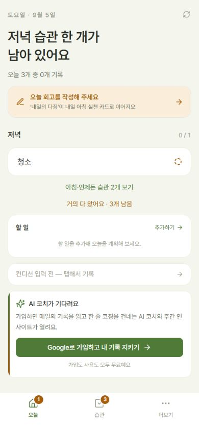
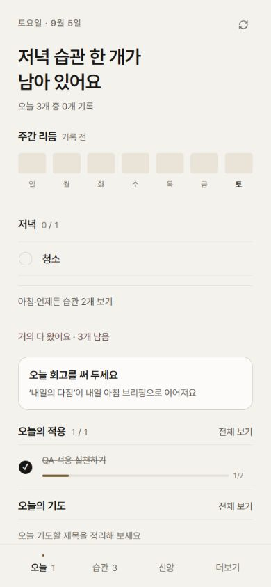
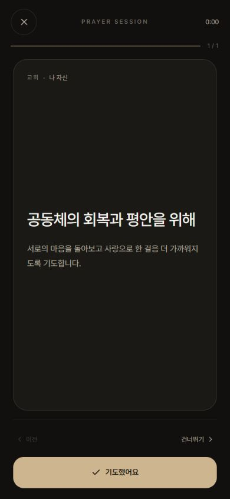

# Habit Garden editorial redesign QA

## 화면 비교

동일한 게스트 데이터와 `390×844` 뷰포트에서 촬영했다. 개편 전 화면은
`pre-redesign-2026-09-05` 릴리스와 같은 운영 버전이며, 개편 후 화면은
`codex/editorial-redesign` 브랜치의 프로덕션 빌드다.

| 개편 전 | 개편 후 |
| --- | --- |
|  |  |

## 기도 모드 후속 조정

- 시작·묵상·기도·완료 전 단계를 차콜 기반 다크 테마로 통일했다.
- 기도제목과 상세를 중앙 읽기 영역에 두고, 연결된 말씀은 카드 하단에
  11px 보조 문장과 10px 출처로 표시한다.
- 이전·더 받기·건너뛰기는 44px 보조 조작 행으로, `기도했어요`는 하단의
  큰 주 동작 버튼으로 분리했다.
- `390×844`와 `1280×900`에서 전체 암전, 중앙 430px 패널, 가로 넘침 없음,
  타이머·진행선·긴 본문 스크롤을 확인했다.

## 자동 검증

- `npm run typecheck`
- `npm run test` — 9개 테스트 파일, 103개 테스트 통과
- `npm run build`
- `git diff --cached --check`

## 브라우저 검증

- `390×844`: 빈 데이터, 일부·전체 기록, 건너뜀, 1–5점 입력, 신앙 기능
  비활성화, 기도 필터·로테이션·상세·일괄 관리, 말씀 적용 상태, 과거 날짜,
  게스트 흐름, 긴 스크롤, 하단 탭, 포커스 및 안전 영역
- `1280×900`: 중앙 430px 앱 캔버스, 860px 높이, 외곽 배경, 내부 스크롤,
  사용자 상세 화면 전체, 키보드 포커스
- 운영 사용자 데이터는 변경하지 않았으며 익명 게스트 QA 데이터만 사용했다.
- Firestore 문서, Cloud Functions, 인증·저장 훅과 외부 API는 변경하지 않았다.
